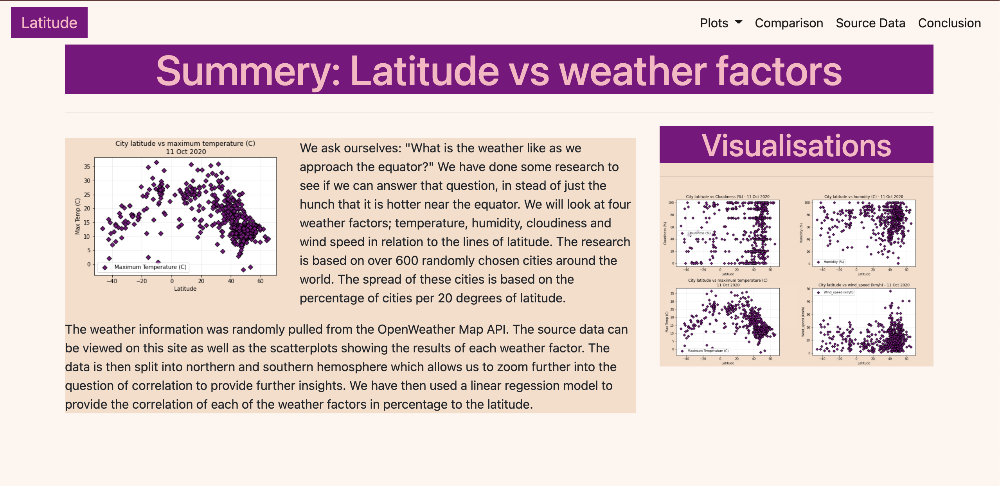
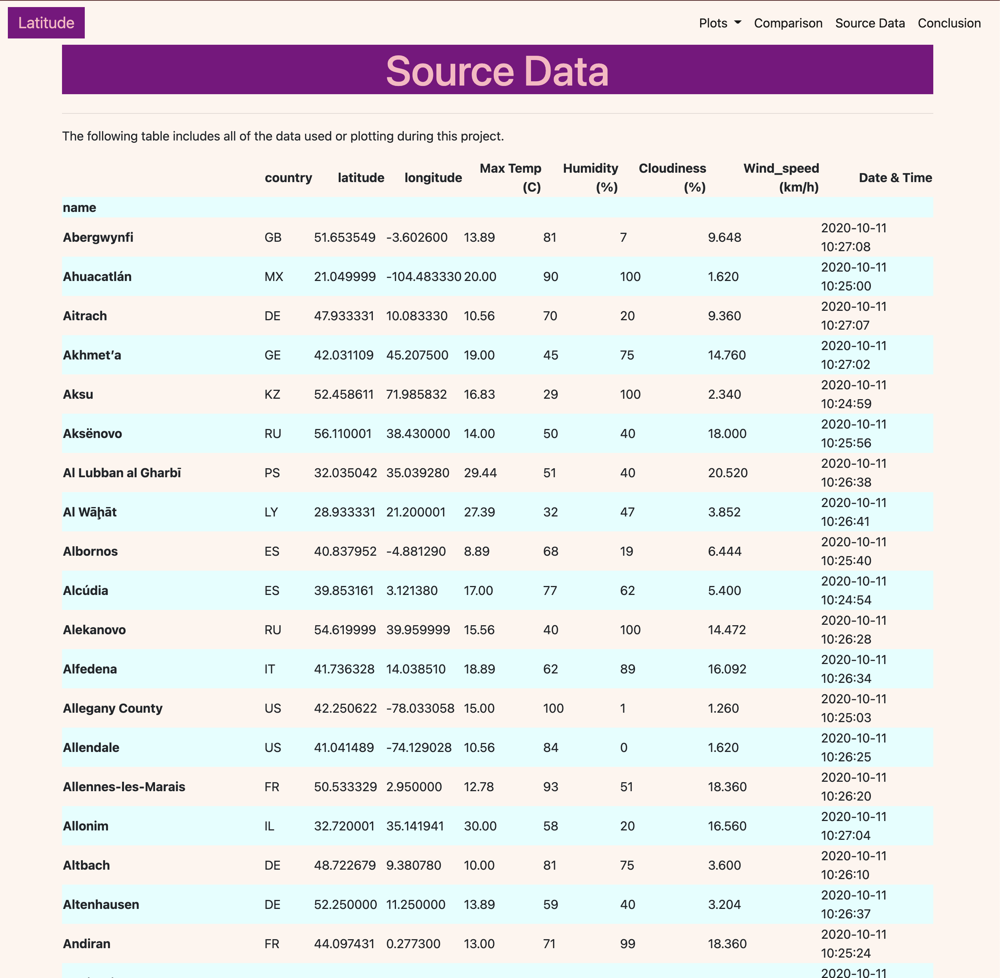

# Web-Design-Challenge
11 Homework - Web Visualisations 

* Building a website using a previous analysis (visualisation of week 6 homework).
* Completed using HTML, CSS and Bootstrap.

Screenshots of the website:

